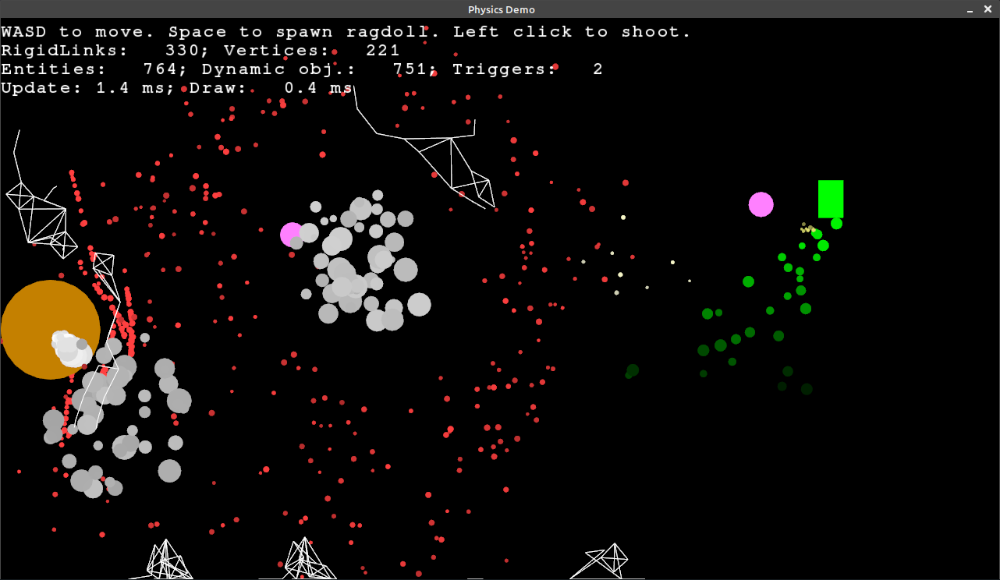

# Physics Game

## Description

This is a game that uses a very simple physics engine that I made.



## Dependencies

- SFML 2.5 - install using following command:

```shell
sudo apt-get install libsfml-dev
```

## Building

The project can be built as follows:

```shell
mkdir build
cd build
cmake ..
make
```

## Running

Inside the build directory the game can be run with:

```shell
cd game
./game
```

## License
This code is licensed under the terms of the MIT license.
